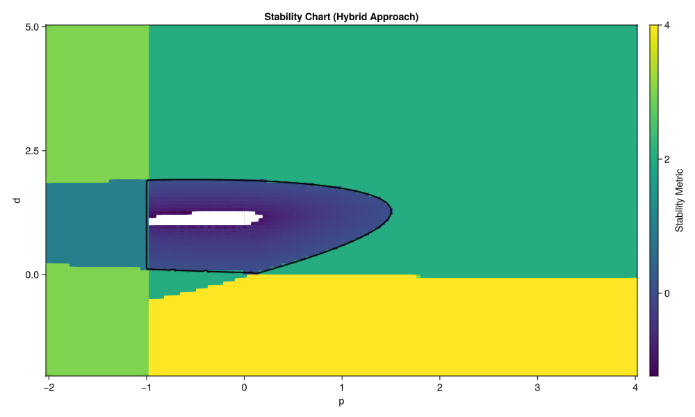

# InterpolatedNyquist.jl

`InterpolatedNyquist.jl` is a high-performance Julia package for determining the stability of delayed dynamical systems using Nyquist-based methods. It combines coarse brute-force sweeps with precise Multi-Dimensional Bisection Method (MDBM) boundary refinement.

## Features
- **Standardized Parameter Handling:** Consistent with `DifferentialEquations.jl` (accepts unified parameter collection `p`).
- **Autodiff-Enhanced:** Uses exact phase derivatives via `ForwardDiff.jl`.
- **Stiff Integration:** Employs robust ODE solvers (like `Rosenbrock23`) to track rapid phase changes without skipping encirclements.
- **Hybrid Strategy:** Fast global sweeps for background mapping, high-precision MDBM for boundary tracing.
- **Error Estimation:** Self-validating numerical integrity based on the winding number's integer requirement.

## Usage Example

The following example demonstrates how to perform a stability sweep over a parameter grid for a 4th-order delayed system.

```julia
using InterpolatedNyquist
using GLMakie

# 1. Define characteristic equation D(λ, p)
# λ: complex frequency, p: parameter collection (tuple/vector/namedtuple)
function D_chareq(λ::T, p) where T
    P, D = p
    τ = T(0.5); ζ = T(0.02)
    return (T(0.03) * λ^4 + λ^2 + T(2) * ζ * λ + one(T) + P * exp(-τ * λ) + D * λ * exp(-τ * λ))
end

# 2. Perform a vectorized stability sweep over a grid
Pv = LinRange(-2.0, 4.0, 60)
Dv = LinRange(-2.0, 5.0, 50)
params_vec = vec([(p, d) for p in Pv, d in Dv])

# calculate_unstable_roots_p_vec returns Int roots, raw values, and diagnostics
Z_ints, Z_raws, min_Ds, σ_ests, ω_crits = calculate_unstable_roots_p_vec(D_chareq, params_vec)

# 3. Process results for plotting
Z_mat = reshape(Z_ints, length(Pv), length(Dv))
σ_mat = reshape(σ_ests, length(Pv), length(Dv))
# Combine Z (instability) with σ_est (robustness metric in stable regions)
C_plot = Z_mat .+ (Z_mat .== 0) .* σ_mat

# 4. Visualize
f = Figure()
ax = Axis(f[1, 1], title="Stability Chart", xlabel="p", ylabel="d")
hm = heatmap!(ax, Pv, Dv, C_plot, colormap=:viridis)
save("stability_chart.png", f)
```

### High-Performance Results
For the 4th-order system above:
- **Global Sweep:** A 3000-point brute-force sweep completes in approximately **0.38 seconds** (excluding compilation).
- **MDBM Refinement:** Tracing the boundary with 4 levels of refinement takes approximately **0.45 seconds**. This achieves an **equivalent resolution of 305 x 305** (~93,000 points) but only requires a few thousand targeted function evaluations.


*Stability Chart generated in < 1s total. The background heatmap shows the coarse grid sweep, while the smooth black lines are the high-precision MDBM boundary (305x305 equivalent resolution).*

## Citing
If you use `InterpolatedNyquist.jl` in your research, please cite the following paper:

> Daniel Bachrathy, et al. "High-Performance Nyquist Stability Analysis of Delayed Dynamical Systems using MDBM and Autodiff-Enhanced Stiff Integration." Journal of Sound and Vibration, 2026.

See `CITATION.bib` for the BibTeX entry.

## Installation
```julia
using Pkg
Pkg.add(url="https://github.com/bachrathyd/InterpolatedNyquist.jl")
```

## Examples Directory
The `examples/` folder contains over 20 detailed test cases, including:
- **Matrix Systems:** Stability of high-dimensional FEM models (50x50 matrices).
- **Neutral Systems:** Handling neutral delay differential equations.
- **Precision Analysis:** Convergence studies and error field mapping.
- **Distributed Delays:** Stability of systems with kernel-based delays.
