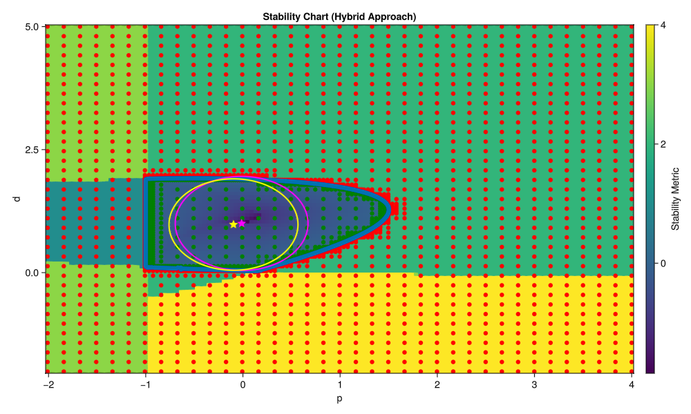

# InterpolatedNyquist.jl

[](https://bachrathyd.github.io/InterpolatedNyquist.jl/dev/)
[](https://github.com/bachrathyd/InterpolatedNyquist.jl/actions/workflows/CI.yml?query=branch%3Amain)

`InterpolatedNyquist.jl` is a high-performance Julia package for determining the stability of delayed dynamical systems using Nyquist-based methods. It combines coarse brute-force sweeps with precise Multi-Dimensional Bisection Method (MDBM) boundary refinement.

## Features
- **Standardized Parameter Handling:** Consistent with `DifferentialEquations.jl` (accepts unified parameter collection `p`).
- **Autodiff-Enhanced:** Uses exact phase derivatives via `ForwardDiff.jl`.
- **Ordered Adaptive March:** The winding integral is solved as a phase ODE with a high-order adaptive pair (`Vern9` by default). The step control resolves the near-singular peaks; the *ordered* traversal is what makes root tracking possible (recursive quadrature visits frequencies out of order and cannot detect the |D| minima).
- **Rightmost-Root Tracking:** The characteristic root closest to the (shiftable) imaginary axis is estimated during the same sweep, with `Val{N}` multi-root tracking.
- **Root Refinement (~free):** Sub-grid precision via **Newton (default, 4 steps)**, Polynomial (Taylor, degree 2/3), or Linear. Refinement adds only a few percent to the per-point cost.
- **Hybrid Strategy:** Fast global sweeps for background mapping, high-precision MDBM for boundary tracing.
- **Error Estimation:** Self-validating integer residual `ε = |Z_raw − round(Z_raw)|`, empirically `ε ≈ 100 × tol`, so the accuracy of `Z` can be prescribed via the tolerance.
- **Model Extraction:** `get_D_from_model` builds `D(λ) = det(λE − J(λ))` directly from a DifferentialEquations.jl-style right-hand side, **including singular mass matrices `E` (delay differential-algebraic systems)** via the `mass_matrix` keyword.
- **Robust Leading-Order Estimation:** `get_n_power_max` probes along the **real axis**, where delay terms decay like `e^{-sτ}` — the arc at infinity lives in the right half-plane, so this measures exactly what the counting formula needs. Accurate to ~1e-9, and it works for neutral/fractional systems and large determinants where an imaginary-axis fit fails.

### Choosing a back-end
| want | use |
|---|---|
| `Z` only | `calculate_unstable_roots_quadgk` — competitive, and more dependable very close to a boundary |
| `Z` **and** the rightmost root | `calculate_unstable_roots_direct` (default) — only the ordered march can track the root |
| interactive/real-time scans | `calculate_unstable_roots_fixed_step` — fastest, accuracy set by `steps` |

Near a stability boundary the integrand peak narrows in proportion to `|Re λ|`; no pointwise method can guarantee it is sampled. The integer residual cannot detect a skipped peak (it costs exactly ±π), but `sign(σ_est)` disagreeing with `Z == 0` does — this cross-check is free and is the recommended safeguard.

## Usage Example

The following example demonstrates how to perform a stability sweep over a parameter grid for a 4th-order delayed system.

```julia
using InterpolatedNyquist
using GLMakie

# 1. Define characteristic equation D(λ, p)
# λ: complex frequency, p: parameter collection (tuple/vector/namedtuple)
function D_chareq(λ::T, p) where T
    P, D = p
    τ = T(0.5); ζ = T(0.02)
    return (T(0.03) * λ^4 + λ^2 + T(2) * ζ * λ + one(T) + P * exp(-τ * λ) + D * λ * exp(-τ * λ))
end

# 2. Perform a vectorized stability sweep over a grid
Pv = LinRange(-2.0, 4.0, 60)
Dv = LinRange(-2.0, 5.0, 50)
params_vec = vec([(p, d) for p in Pv, d in Dv])

# calculate_unstable_roots_p_vec returns Int roots, raw values, and diagnostics
Z_ints, Z_raws, min_Ds, σ_ests, ω_crits = calculate_unstable_roots_p_vec(D_chareq, params_vec)

# 3. Process results for plotting
Z_mat = reshape(Z_ints, length(Pv), length(Dv))
σ_mat = reshape(σ_ests, length(Pv), length(Dv))
# Combine Z (instability) with σ_est (robustness metric in stable regions)
C_plot = Z_mat .+ (Z_mat .== 0) .* σ_mat

# 4. Visualize
f = Figure()
ax = Axis(f[1, 1], title="Stability Chart", xlabel="p", ylabel="d")
hm = heatmap!(ax, Pv, Dv, C_plot, colormap=:viridis)
save("stability_chart.png", f)
```

### High-Performance Results
For the 4th-order system above:
- **Global Sweep:** A 15 000-point brute-force sweep completes in approximately **~0.3 seconds** (excluding compilation).
- **MDBM Refinement:** Tracing the boundary with 4 levels of refinement takes approximately **~0.10 seconds**. This achieves an **equivalent resolution of 305 x 305** (~93,000 points) but only requires a few thousand targeted function evaluations.


*Stability Chart generated in < 1s total. The background heatmap shows the coarse grid sweep. The negative values (with gradual color change) shows the apprximated right most charateristic roos, thepositive (uniform colors) show the number of unstable toots.The smooth black lines are the high-precision MDBM boundary (305x305 equivalent resolution).*

## Citing
If you use `InterpolatedNyquist.jl` in your research, please cite the following paper (not submitted yet ;-) ):

> Daniel Bachrathy. "Interpolable Nyquist criterion: fast stability charts and rightmost-root estimation for linear time-delay systems via adaptive stiff integration." ?Journal of Sound and Vibration, 2026?. (Manuscript and all reproduction scripts in the `paper/` directory.)

See `CITATION.bib` for the BibTeX entry.

## Installation
```julia
using Pkg
Pkg.add("InterpolatedNyquist")
```

## Examples Directory
The `examples/` folder contains over 20 detailed test cases, including:
- **Matrix Systems:** Stability of high-dimensional FEM models (50x50 matrices).
- **Neutral Systems:** Handling neutral delay differential equations.
- **Precision Analysis:** Convergence studies and error field mapping.
- **Distributed Delays:** Stability of systems with kernel-based delays.
